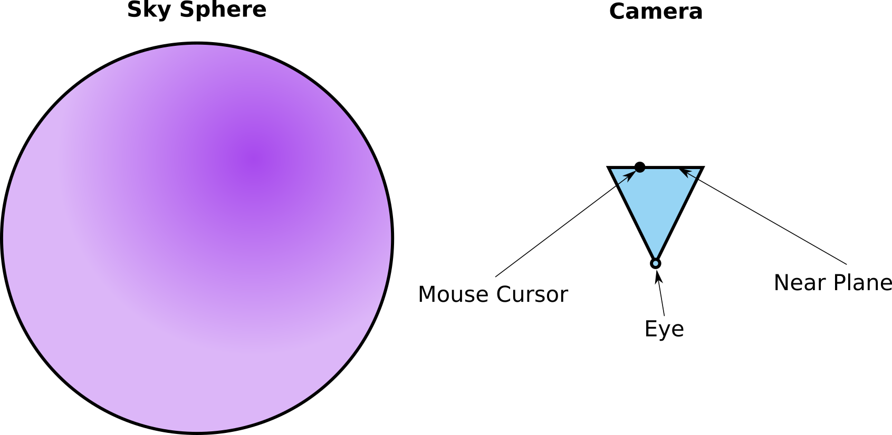

# Worksheet 6 - A World Made of Drawings

**Due: Friday, April 22, 11:59pm CDT**

For the worksheets in this course, we will provide a Markdown template in a repository that will be created for you through GitHub classroom.  You can clone this repository, directly edit your local copy with your answers, and then commit and push the file to complete the submission.  Alternatively, you can use GitHub's built-in Markdown editor and edit directly on your repository website without having to clone it locally. 

*Do not make a copy of the provided Markdown template and submit that instead.* Our grading scripts will be looking for `README.md` within the root folder of your repository.  You should modify this template directly without changing the filename.


## Q1: Mouse-Sky Intersections (Part 1)

For this assignment, one of the key parts is to check what part of the virtual environment your mouse is currently touching. This useful for determining what type of stroke should be drawn when the mouse is clicked and dragged.

From the assignment readme, we know that the sky here is really just a giant sphere with a radius of 500 units. In order to calculate where in the sky our mouse is pointing in the scene, we need to perform a *ray-sphere intersection* test. The ray starts at the eye location (camera position), and goes through the current mouse location on the near clipping plane. This ray can be traced to figure out where it intersects the sky sphere.

Create a top-down diagram of the scene including the sky sphere, the camera, the mouse position, and the aforementioned ray from the eye through the mouse position.  You can use the following image as inspiration for the shapes that you draw in your diagram (replace it with your final diagram):





## Q2: Mouse-Sky Intersections (Part 2): 

Now, let's create the building blocks for the mouse-sky intersection code in the `onMouseDown` method of the `DrawingApp` class, which tests to see where the ray from the eye through the mouse intersects the sky sphere. We already have the following variables defined:

- The synthetic camera (`this.camera`)
- The normalized device coordinates of the mouse (`deviceCoords`)
  - Type `THREE.Vector2`
  - Inclusive range [-1, 1]
  - (-1, 1) is the upper left corner, and (1, -1) is the lower right

- A `THREE.Raycaster` configured using the above two variables.
- The 3D mesh for the sky sphere (`this.skySphere`)

This gives us all we need to create a pick ray that projects the mouse position to the sky!  Take a look at the code blocks for the billboard and ground intersections in the `onMouseDown` method, and try to construct a similar intersection test for the sky sphere, and then create a new `Billboard` at the intersection point.

```typescript
// Add your intersection test here
```

Next, write the code that will create a new `Billboard` object at the intersection point. Note that the intersection test should *always* return a result as long as we are inside the sphere.  (In other words, an if statement is not strictly required, unless we expect the user to walk half a kilometer and "escape" from the sky sphere.)

```typescript
// Add your billboard creation code here
```


## License

Material for [CSCI 4611 Spring 2022](https://canvas.umn.edu/courses/290928/assignments/syllabus) by [Evan Suma Rosenberg](https://illusioneering.umn.edu/) is licensed under a [Creative Commons Attribution-NonCommercial-ShareAlike 4.0 International License](http://creativecommons.org/licenses/by-nc-sa/4.0/).